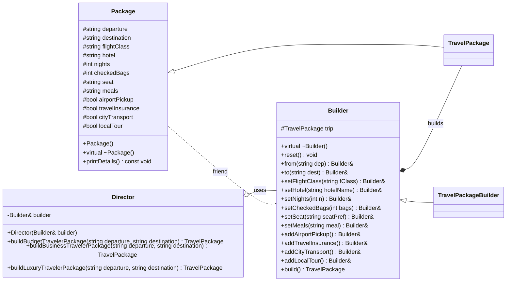

# FlySmart UML Class Diagram

```mermaid
classDiagram
    direction LR

    class Package {
        #string departure
        #string destination
        #string flightClass
        #string hotel
        #int nights
        #int checkedBags
        #string seat
        #string meals
        #bool airportPickup
        #bool travelInsurance
        #bool cityTransport
        #bool localTour
        +Package()
        +virtual ~Package()
        +printDetails() const void
    }

    class TravelPackage {
    }

    class Builder {
        #TravelPackage trip
        +virtual ~Builder()
        +reset() void
        +from(string dep) Builder&
        +to(string dest) Builder&
        +setFlightClass(string fClass) Builder&
        +setHotel(string hotelName) Builder&
        +setNights(int n) Builder&
        +setCheckedBags(int bags) Builder&
        +setSeat(string seatPref) Builder&
        +setMeals(string meal) Builder&
        +addAirportPickup() Builder&
        +addTravelInsurance() Builder&
        +addCityTransport() Builder&
        +addLocalTour() Builder&
        +build() TravelPackage
    }

    class TravelPackageBuilder {
    }

    class Director {
        -Builder& builder
        +Director(Builder& builder)
        +buildBudgetTravelerPackage(string departure, string destination) TravelPackage
        +buildBusinessTravelerPackage(string departure, string destination) TravelPackage
        +buildLuxuryTravelerPackage(string departure, string destination) TravelPackage
    }

    Package <|-- TravelPackage
    Builder <|-- TravelPackageBuilder
    Builder *-- TravelPackage : builds
    Director o-- Builder : uses
    Package .. Builder : friend
```
