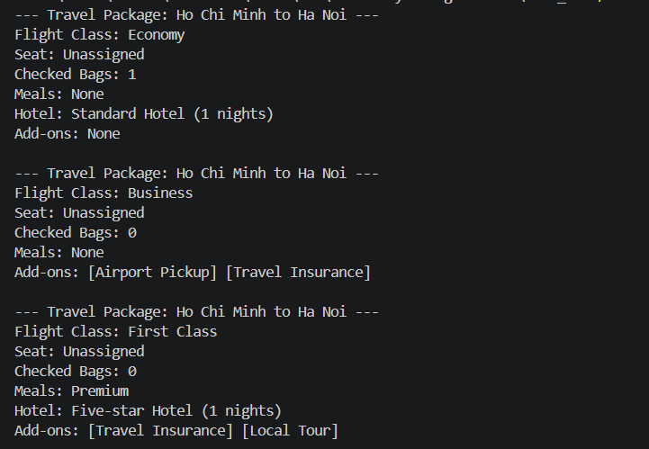

# FlySmart International Travel Platform

## Deliverables for Case 1
### 8. UML Class Diagram
> [!NOTE]
The UML class diagram is provided in [`Mermaid.md`](Mermaid.md)
### 9, 10. C++ Implementation and Demonstration with three Package Examples

> [!NOTE]
The implementation is written in C++ in [`FlySmart.hpp`](FlySmart.hpp), and the demo program with 3 Package Examples is in [`main.cpp`](main.cpp).

### 11. Validation and Error Handling

Validation is performed inside `Builder::build()` before returning the final object.

The builder checks:

- Departure, destination, and flight class must be provided.
- Departure and destination cannot be the same.
- Number of nights cannot be negative.
- Checked baggage cannot be negative.
- If a hotel is selected, nights must be greater than zero.
- Private airport limousine / airport pickup is only valid for Business or First Class packages.

If a rule is violated, the program throws `std::invalid_argument`. The `catch()` block in `main()` catches `std::exception` and prints the error message.

### 12. State-Reuse Bug and Correction

The state-reuse bug happens when the same builder object is reused without clearing its previous state. Optional fields from an old package may accidentally appear in the next package.

Example problem:

```cpp
TravelPackageBuilder builder;

auto first = builder.from("Ho Chi Minh")
    .to("Ha Noi")
    .setFlightClass("First Class")
    .addLocalTour()
    .build();

auto second = builder.from("Da Nang")
    .to("Singapore")
    .setFlightClass("Economy")
    .build();
```

Without reset logic, `second` may incorrectly keep options from `first`.

Correction:

- `Builder::build()` calls `reset()` after moving out the completed package.
- `Director` also calls `builder.reset()` before each recipe.

This makes the builder reusable and prevents old state from leaking into new packages.

### 13. Selected Design Pattern

The selected design pattern is the **Builder pattern**.

It is suitable because a travel package has many optional parameters, such as hotel, meals, baggage, airport pickup, insurance, city transport, and local tours. Using a long constructor would be hard to read and easy to misuse.

The Builder pattern improves readability by allowing step-by-step configuration:

```cpp
builder.from("Ho Chi Minh")
    .to("Ha Noi")
    .setFlightClass("Business")
    .addTravelInsurance()
    .build();
```

The Director pattern is also used to define standard package recipes. This keeps common package creation logic in one place.

## Discussion Questions

### 14. Is Inheritance Necessary?

Inheritance is currently not necessary for this construction design. A single concrete builder can already create the package correctly.

However, inheritance can be useful if the system later needs multiple builder types with the same construction interface. In this implementation, `TravelPackageBuilder` inherits from `Builder`, but the main construction logic is placed in `Builder` to avoid duplicated code.

### 15. Is a Director-like Object Required?

**Not really**, `the Director` object is not required.

Because client code can call the builder methods directly (hardcode), but this way goes against the Marketing requirement that *these presets created consistently without duplicating the same configuration code throughout the application*.  

Another way is introducing in each `PackageBuilder` some **Static Factory Methods** like `TravelPackage::createBudgetTraveler()`, `TravelPackage::createBusinessTraveler()`

The Director and Factory Method do the same things that they hide the step-by-step construction details and gives clear methods to create Standard Packages. They are both efficient and flexible, I just prefer Director-like Object more because I am on Standardlized Builder Pattern flow.

### 16. Who Should Perform Validation?

The **construction object** should perform most validation because it knows the temporary state before the product is completed. The product may also protect its own invariants in a larger system, but in this case, in my solution, validation inside `Builder::build()` is enough because packages are only created through the builder.

### 17. After `build()`, Should the Builder Reset, Become Unusable, or Remain Reusable?

**In this solution, the builder resets after `build()` and remains reusable.**

This is convenient because the same builder can create many packages. The trade-off is that `build()` must carefully clear all internal state to avoid state-reuse bugs. If the object became unusable after `build()`, it would be safer but less flexible.

### 18. If `build()` Returns `std::move(package)`, What Happens to the Internal Object?

When `build()` returns `std::move(trip)`, the internal `trip` is moved into the result. The moved-from object is still valid, but its content should not be relied on. Therefore, the builder calls `reset()` after moving the package. This gives the builder a fresh internal `TravelPackage` for the next construction.

## Test Evidence:


