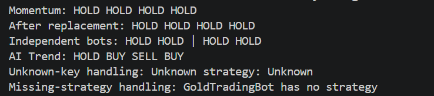

# AurumTech Gold Trading Platform

## Architecture Comparison

- Version A *(Also my choice for provided implementation)* stores creation logic. Calling `creators[name]()` executes the registered function, which constructs and returns a new strategy. It is therefore a **Factory Registry**.

- Version B stores configured prototype objects. If `objects[name]->clone()` creates a new strategy, it is a **Prototype Registry**. The new instance is produced by copying the stored prototype, including its configuration and state according to the `clone()` implementation.

>[!IMPORTANT]
These mechanisms are related because both can return a fresh object, but they are not conceptually identical. Version A creates an object from a creator function; Version B creates an object by cloning an existing object. Version B is a deep copy only when `clone()` correctly copies all owned resources.

## Lifetime Challenge

The following design is unsafe if `GoldTradingBot` stores a raw `TradingStrategy*`:

```cpp
GoldTradingBot createBot()
{
    MomentumStrategy strategy;
    GoldTradingBot bot(&strategy);
    return bot;
}
```

`strategy` is a local object and is destroyed when `createBot()` returns. The returned bot then contains a dangling pointer. Calling `analyze()` on that pointer causes undefined behavior.

A safer ownership model is to let the bot own the strategy through `std::unique_ptr`:

```cpp
GoldTradingBot createBot()
{
    return GoldTradingBot(std::make_unique<MomentumStrategy>());
}
```

The strategy's lifetime is then tied to the bot. It is destroyed automatically when the bot is destroyed or when a new strategy replaces it. This is the ownership model used in the implementation.

## Deliverables for Case 2
### 19. UML Class Diagram
> [!NOTE]
The UML class diagram is provided in [`Mermaid.md`](Mermaid.md).

### 20. Trading Behavior Abstraction and Three Concrete Algorithms

The solution applies the **Strategy pattern**. `TradingStrategy` defines the common interface, while the concrete strategies implement different trading rules:

- `ConservativeStrategy` stores recent prices and buys when the current price is sufficiently below the recent average.
- `MomentumStrategy` stores price history and buys or sells after a sustained upward or downward movement.
- `ThresholdStrategy` uses configurable buy and sell thresholds.

`GoldTradingBot` delegates the analysis decision to its current strategy. The bot does not contain a conditional chain for individual algorithms.

### 21. Runtime Behavior Replacement

`GoldTradingBot::setStrategy()` accepts a new `std::unique_ptr<TradingStrategy>`. Therefore, the bot can change its decision behavior at runtime without modifying the bot class or adding another conditional branch.

Example:

```cpp
GoldTradingBot bot(std::make_unique<MomentumStrategy>());
bot.setStrategy(std::make_unique<ConservativeStrategy>());
```

### 22, 23. Runtime Registration and Safe Unknown-Key Handling

`StrategyRegistry` stores creator functions using:

```cpp
std::function<std::unique_ptr<TradingStrategy>()>
```

Each call to `create(name)` invokes the selected creator and returns a fresh strategy object. Third-party code can register a new algorithm without modifying the registry's internal conditional logic:

```cpp
registry.registerStrategy("AI Trend", [] {
    return std::make_unique<AITrendStrategy>();
});
```

Unknown names throw `std::invalid_argument`. Duplicate names, empty names, and empty creators are also rejected.

### 24. Ownership and Lifetime Explanation

`GoldTradingBot` owns its strategy through `std::unique_ptr<TradingStrategy>`. Ownership is transferred when the bot is constructed or when `setStrategy()` is called. The previous strategy is destroyed automatically when it is replaced.

This avoids the dangling-pointer problem caused by storing a pointer to a local strategy:

```cpp
// Unsafe: localStrategy is destroyed before the returned bot is used.
MomentumStrategy localStrategy;
```

The virtual destructor in `TradingStrategy` ensures safe destruction through the base pointer. Each bot should own an independent stateful strategy because strategy history affects future decisions.

### 25. Test Cases

The demonstration in [`main.cpp`](main.cpp) includes at least five cases:

1. Momentum strategy analysis.
2. Runtime replacement with `ConservativeStrategy`.
3. Two independent stateful momentum strategies.
4. Runtime registration and creation of `AITrendStrategy`.
5. Safe handling of an unknown registry key.
6. Safe handling of a bot without a strategy.

The third case is the required stateful algorithm test. The two bots have separate histories, so one bot's price stream does not affect the other bot's decisions.

## Discussion Questions

### 26. What Responsibility Belongs to the Trading Bot and the Trading Algorithm?

The trading bot manages the application workflow: it receives prices, owns the selected strategy, and delegates analysis. The trading algorithm owns the decision rule and any internal state, such as price history or threshold values. The bot should not know the details of each algorithm.

### 27. What Responsibility Belongs to the Registry?

The registry maps names to strategy creators. It is responsible for registration, duplicate-name validation, lookup, object creation, removal, and safe handling of unknown names. It should not perform trading analysis or manage the lifetime of strategies after they are returned.

### 28. Is Inheritance Mandatory for Interchangeable Algorithms?

**No**. Inheritance is a clear choice here because the algorithms share a polymorphic interface and may contain state. However, modern C++ alternatives include `std::function` for small stateless callables, or templates when the algorithm type can be selected at compile time.

### 29. Does a Method Named `create()` Automatically Mean a Factory Pattern?

> [!IMPORTANT]
**Always a big NO** for any question like this. **A method name does not determine a design pattern**. 

The important point is the responsibility and structure. A method named `create()` could also simply be a normal helper method.

Here, the registry stores creator functions and uses them to produce strategy objects, so the registry behaves as a **Factory Registry**.

### 30. When Would Sharing a Stateful Strategy Be Intentional?

Sharing would be intentional when multiple bots are required to observe and update one common model, such as a centralized market history, coordinated risk state, or shared portfolio limit. In that case, shared state must be explicit and synchronized when necessary. For independent investors, sharing is undesirable because one bot's observations would influence another bot's decisions.

## Selected Design Patterns

The primary pattern is the **Strategy pattern**, which encapsulates interchangeable trading algorithms behind `TradingStrategy`. The registry also uses a **Factory-style creation mechanism** because it stores creator functions rather than configured prototype objects.

## Test Evidence




