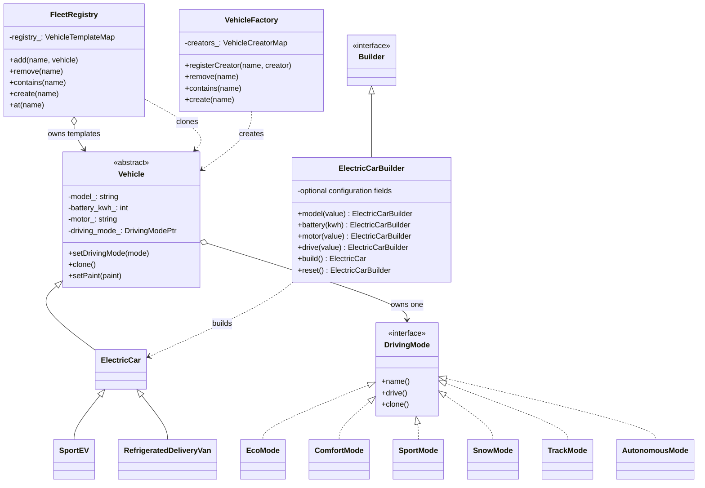

> [!NOTE]
`EcoMode` and `SportMode` are built into `VoltEdge.hpp`.
`ComfortMode`, `SnowMode`, `TrackMode`, and `AutonomousMode` are declared in `main.cpp` as application extensions.
`RefrigeratedDeliveryVan` is also declared in `main.cpp` as a partner vehicle plugin and registered through `VehicleFactory`.
