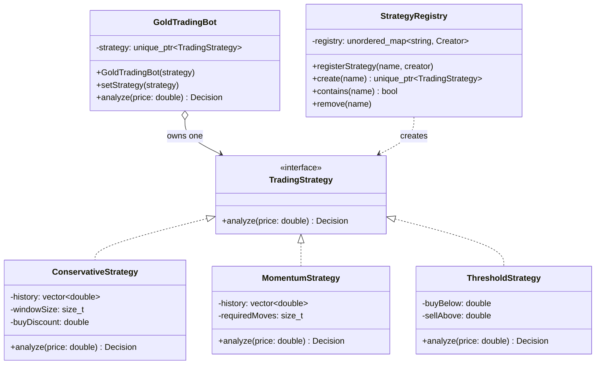

# Case 2 UML Class Diagram

```mermaid
classDiagram
    class TradingStrategy {
        <<interface>>
        +analyze(price: double) Decision
    }

    class ConservativeStrategy {
        -history: vector~double~
        -windowSize: size_t
        -buyDiscount: double
        +analyze(price: double) Decision
    }

    class MomentumStrategy {
        -history: vector~double~
        -requiredMoves: size_t
        +analyze(price: double) Decision
    }

    class ThresholdStrategy {
        -buyBelow: double
        -sellAbove: double
        +analyze(price: double) Decision
    }

    class GoldTradingBot {
        -strategy: unique_ptr~TradingStrategy~
        +GoldTradingBot(strategy)
        +setStrategy(strategy)
        +analyze(price: double) Decision
    }

    class StrategyRegistry {
        -registry: unordered_map~string, Creator~
        +registerStrategy(name, creator)
        +create(name) unique_ptr~TradingStrategy~
        +contains(name) bool
        +remove(name)
    }

    TradingStrategy <|.. ConservativeStrategy
    TradingStrategy <|.. MomentumStrategy
    TradingStrategy <|.. ThresholdStrategy
    GoldTradingBot o--> TradingStrategy : owns one
    StrategyRegistry ..> TradingStrategy : creates
```
